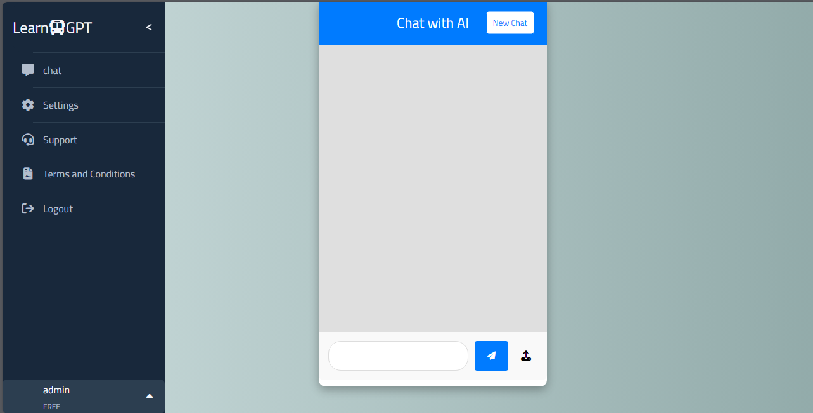

# LearnGpt - ChatGPT Django with Docker



## Project Overview

**LearnGpt** is a Django-based web application that allows users to interact with OpenAI's ChatGPT API. The project is containerized using Docker, ensuring an easy and consistent deployment experience across various environments.

## Features

- Django as the backend framework.
- Integration with OpenAI's ChatGPT API.
- Dockerized environment for easy setup and consistent development.

## Prerequisites

Before setting up the project, make sure you have the following installed:

- [Docker](https://www.docker.com/get-started)
- [Docker Compose](https://docs.docker.com/compose/install/)
- [OpenAI API Key](https://platform.openai.com/signup)

## Installation and Setup

### 1. Clone the Repository

Start by cloning the repository to your local machine:

```bash
git clone https://github.com/Ahmed-Nagi1/learngpt.git
cd learngpt
pip install -r requirements.txt 
```
### 2. Add Api
Look at env file

### 3. Run the project

Start by cloning the repository to your local machine:

```bash
docker-compose -f docker-compose.yml up --build